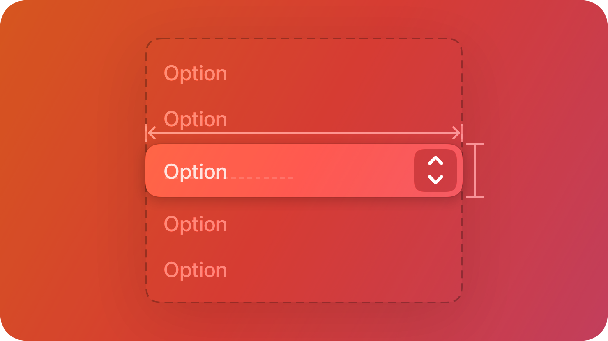

# PopUpButton

A `PopUpbutton` displays a menu of mutually exclusive options.



## Summary

### Properties

| Property       | Type       | Description |
|----------------|------------|-------------|
| `Options` | `#!luau {[number]: string}?` | You can use this table to pre-define options. Note that doing it this way will not give you access to the option instances themselves. |
| `Maximum` | `#!luau number?` | Maximum number of selectable options. Defaults to `1` (single-select). |
| `Value` | `#!luau number? or {number}?` | The selected index (single) or a table of selected indices when `Maximum > 1`. |

[View all inherited from `BaseComponent`](./index.md/#properties)

[View all inherited from `Frame`](https://create.roblox.com/docs/reference/engine/classes/Frame#summary-properties)

### Methods

| Method         | Signature     | Description |
|----------------|---------------|-------------|
| `Option` | `#!luau (Name: string?) -> Frame` | Can be used to seperately create options, use this if you want to access the option instances themselves. An example of use would be a dynamically updating playerlist. |
| `Remove` | `#!luau (Index: number?) -> nil,` | Can be used to remove options from the pop-up menu, this automatically removes it from the options list as well. |

[View all inherited from `Frame`](https://create.roblox.com/docs/reference/engine/classes/Frame#summary-methods)

### Events

| Event          | Signature     | Description |
|----------------|---------------|-------------|
| `ValueChanged` | `#!luau ((self: PopUpButton, value: number or {number}) -> unknown)?` | A Callback function that is triggered when the `Value` property has been modified. |

[View all inherited from `Frame`](https://create.roblox.com/docs/reference/engine/classes/Frame#summary-events)

## Types

```luau
type PopUpButtonProperties = Frame & {
    Options: { [number]: string }?,
    Expanded: boolean?,
    Maximum: number?,
    Value: (number | {number})?,
    ValueChanged: ((self: PopUpButton, value: number | {number}) -> unknown)?,
}

type PopUpButton = BaseComponent & Components & PopUpButtonProperties & {
    Option: (Name: string?) -> Frame,
    Remove: (Index: number?) -> nil,
}
```

### Function Signature

```luau
function(self, properties: PopUpButtonProperties): PopUpButton
```

## Example

```luau
local popUpButton = row:Right():PopUpButton({
    Options = {
        "Item One",
        "Item Two",
    },
    ValueChanged = function(self, value: number)
        print("Value changed:", self.Options[value])
    end,
})

print(popUpButton:IsA("Frame")) --> true
print(popUpButton.ClassName) --> "Frame"
print(popUpButton.Type) --> "PopUpButton"

popUpButton.Value = 3 --> Value changed: "Item Three"

local itemThree = popUpButton:Option("Item Three")

print(itemThree.ClassName) --> Frame
popUpButton:Remove(13)
```

## Multi-select Example

```luau
local multi = row:Right():PopUpButton({
    Options = {"One","Two","Three","Four"},
    Maximum = 3,
    ValueChanged = function(self, value)
        -- `value` is ALWAYS a table of indices when `Maximum > 1` even if only 1 value is selected.
        print("Selections:")
        for _, idx in ipairs(value or {}) do
            print(self.Options[idx])
        end
    end,
})

local five = multi:Option("Five")

multi.Value = {1, 3}
```
