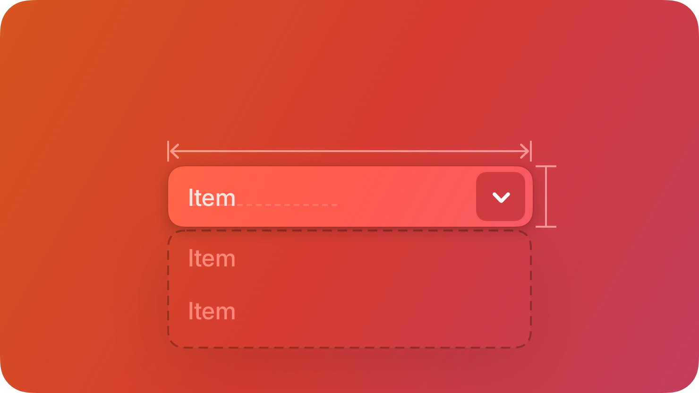

# PullDownButton

A `PullDownButton` displays a menu of mutually exclusive options.



## Summary

### Properties

| Property       | Type       | Description |
|----------------|------------|-------------|
| `Options` | `#!luau {[number]: string}?` | You can use this table to pre-define options. Note that doing it this way will not give you access to the option instances themselves. |
| `Value` | `#!luau number?` | The numeric index of the option to be selected. |

[View all inherited from `BaseComponent`](./index.md/#properties)

[View all inherited from `Frame`](https://create.roblox.com/docs/reference/engine/classes/Frame#summary-properties)

### Methods

| Method         | Signature     | Description |
|----------------|---------------|-------------|
| `Option` | `#!luau (Name: string?) -> Frame` | Can be used to seperately create options, use this if you want to access the option instances themselves. |
| `Remove` | `#!luau (Index: number?) -> nil,` | Can be used to remove options from the pull-down menu, this automatically removes it from the options list as well. |

[View all inherited from `Frame`](https://create.roblox.com/docs/reference/engine/classes/Frame#summary-methods)

### Events

| Event          | Signature     | Description |
|----------------|---------------|-------------|
| `ValueChanged` | `#!luau ((self: PullDownButton, value: string) -> unknown)?` | A Callback function that is triggered when the `Value` property has been modified. |

[View all inherited from `Frame`](https://create.roblox.com/docs/reference/engine/classes/Frame#summary-events)

## Types

```luau
type PullDownButtonProperties = Frame & {
    Options: { [number]: string }?,
    Expanded: boolean?,
    Label: string?,
    Value: number?,
    ValueChanged: ((self: PullDownButton, value: number) -> unknown)?,
}

type PullDownButton = BaseComponent & Components & PullDownButtonProperties & {
    Option: (Name: string?) -> Frame,
    Remove: (Index: number?) -> nil,
}
```

### Function Signature

```luau
function(self, properties: PullDownButtonProperties): PullDownButton
```

## Example

```luau
local pullDownButton = row:Right():PullDownButton({
    Options = {
        "Action One",
        "Action Two",
    },
    ValueChanged = function(self, value: number)
        print("Action selected:", self.Options[value])
    end,
})

print(pullDownButton:IsA("Frame")) --> true
print(pullDownButton.ClassName) --> "Frame"
print(pullDownButton.Type) --> "PullDownButton"

pullDownButton.Value = 3 --> Value changed: "Item Three"

local itemThree = pullDownButton:Option("Item Three")

print(itemThree.ClassName) --> Frame
pullDownButton:Remove(13)
```
