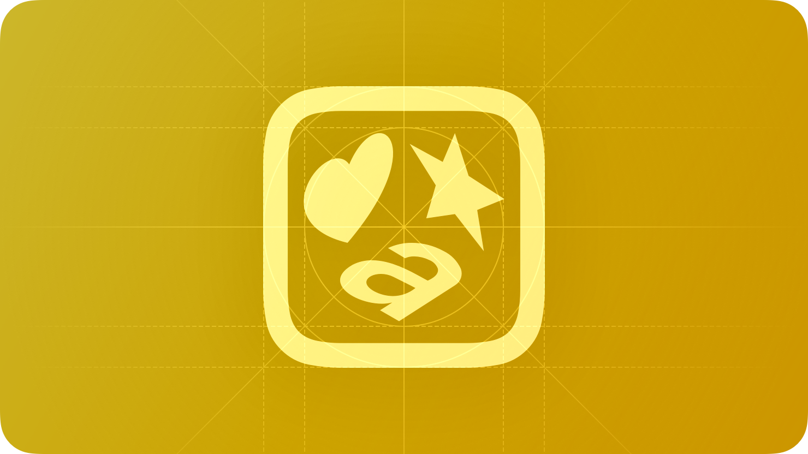

# Symbol

A `Symbol` is a static image component mainly used to add visual context and branding to an interface.



## Summary

### Properties

[View all inherited from `BaseComponent`](./index.md/#properties)

[View all inherited from `ImageLabel`](https://create.roblox.com/docs/reference/engine/classes/ImageLabel#summary-properties)

### Methods

[View all inherited from `ImageLabel`](https://create.roblox.com/docs/reference/engine/classes/ImageLabel#summary-methods)

### Events

[View all inherited from `ImageLabel`](https://create.roblox.com/docs/reference/engine/classes/ImageLabel#summary-events)

## Types

```luau
type SymbolProperties = ImageLabel & {
    Style: ("Primary" | "Secondary")?,
}

type Symbol = BaseComponent & Components & SymbolProperties
```

### Function Signature

```luau
function(self, properties: SymbolProperties): Symbol
```

## Example

```luau
local symbol = row:Right():Symbol({
    Image = cascade.Symbols.sunMin,
})

print(symbol:IsA("ImageLabel")) --> true
print(symbol.ClassName) --> "ImageLabel"
print(symbol.Type) --> "Symbol"
```
