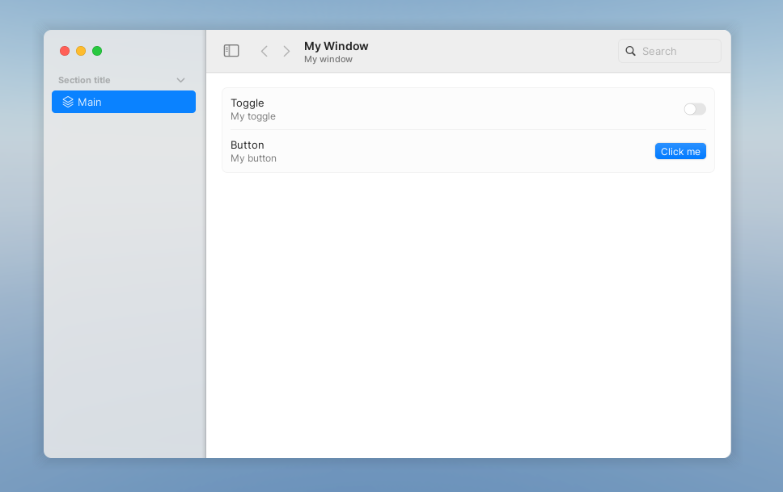
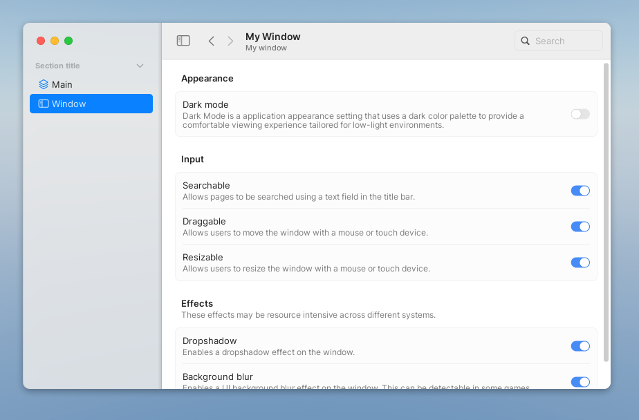

# Example

View a example application that can be made with Cascade.

!!! note
    You can view a larger test application here which has full keybind minimization and mobile resize already added: [tests/test.luau](https://github.com/biggaboy212/Cascade/blob/main/tests/test.luau)

## Creating a basic app

### Code

```luau
-- (1)

-- Create our main application.
local app = cascade.New({ Theme = cascade.Themes.Light })

do -- Make the main window
    local window = app:Window({
        Title = "My Window",
        Subtitle = "My window",
    })

    do -- Make a static tab section
        local section = window:Section({ Title = "Section title" })

        do -- Make our main tab
            local tab = section:Tab({
                Selected = true,
                Title = "Main",
                Icon = cascade.Symbols.squareStack3dUp,
            })

            do
                local form = tab:Form()
            
                do -- Make the toggle
                    local row = form:Row()

                    -- You can of course add a wrapper to simplify creating page components if you only want a title stack and a component to go along.
                    row:Left():TitleStack({
                        Title = "Toggle",
                        Subtitle = "My toggle",
                    })

                    row:Right():Toggle()
                end

                do -- Make the button
                    local row = form:Row()

                    row:Left():TitleStack({
                        Title = "Button",
                        Subtitle = "My button",
                    })

                    row:Right():Button({ Label = "Click me" })
                end
            end
        end
    end
end
```

1. This assumes you already have cascade imported and defined as `cascade` above this.

### Result



## Adding a settings page

### Code

Add this below the existing tab.

```luau
do -- Window
    local tab = section:Tab({
        Title = "Window",
        Icon = cascade.Symbols.sidebarLeft,
    })

    do -- Appearance
        local form = tab:PageSection({ Title = "Appearance" }):Form() -- (1)

        do -- Dark mode
            local row = form:Row({
                SearchIndex = "Dark mode",
            })

            row:Left():TitleStack({
                Title = "Dark mode",
                Subtitle = "Dark Mode is a application appearance setting that uses a dark color palette to provide a comfortable viewing experience tailored for low-light environments.",
            })

            row:Right():Toggle({
                Value = app.Theme == cascade.Themes.Dark,
                ValueChanged = function(self, value: boolean)
                    app.Theme = value and cascade.Themes.Dark or cascade.Themes.Light
                end,
            })
        end
    end

    do -- Input
        local form = tab:PageSection({ Title = "Input" }):Form()

        do -- Searching
            local row = form:Row({
                SearchIndex = "Searchable",
            })

            row:Left():TitleStack({
                Title = "Searchable",
                Subtitle = "Allows pages to be searched using a text field in the title bar.",
            })

            row:Right():Toggle({
                Value = window.Searching,
                ValueChanged = function(self, value: boolean)
                    window.Searching = value
                end,
            })
        end

        do -- Draggable
            local row = form:Row({
                SearchIndex = "Draggable",
            })

            row:Left():TitleStack({
                Title = "Draggable",
                Subtitle = "Allows users to move the window with a mouse or touch device.",
            })

            row:Right():Toggle({
                Value = window.Draggable,
                ValueChanged = function(self, value: boolean)
                    window.Draggable = value
                end,
            })
        end

        do -- Resizable
            local row = form:Row({
                SearchIndex = "Resizable",
            })

            row:Left():TitleStack({
                Title = "Resizable",
                Subtitle = "Allows users to resize the window with a mouse or touch device.",
            })

            row:Right():Toggle({
                Value = window.Resizable,
                ValueChanged = function(self, value: boolean)
                    window.Resizable = value
                end,
            })
        end
    end

    do -- Effects
        local form = tab:PageSection({
            Title = "Effects",
            Subtitle = "These effects may be resource intensive across different systems.",
        }):Form()

        do -- Dropshadow
            local row = form:Row({
                SearchIndex = "Dropshadow",
            })

            row:Left():TitleStack({
                Title = "Dropshadow",
                Subtitle = "Enables a dropshadow effect on the window.",
            })

            row:Right():Toggle({
                Value = window.Dropshadow,
                ValueChanged = function(self, value: boolean)
                    window.Dropshadow = value
                end,
            })
        end

        do -- UI Blur
            local row = form:Row({
                SearchIndex = "Background blur",
            })

            row:Left():TitleStack({
                Title = "Background blur",
                Subtitle = "Enables a UI background blur effect on the window. This can be detectable in some games.",
            })

            row:Right():Toggle({
                Value = window.UIBlur,
                ValueChanged = function(self, value: boolean)
                    window.UIBlur = value
                end,
            })
        end
    end
end
```

1. You can create a page section to organize forms, which helps the reader quickly scan over content in a tab to see what they need to do.

### Result


